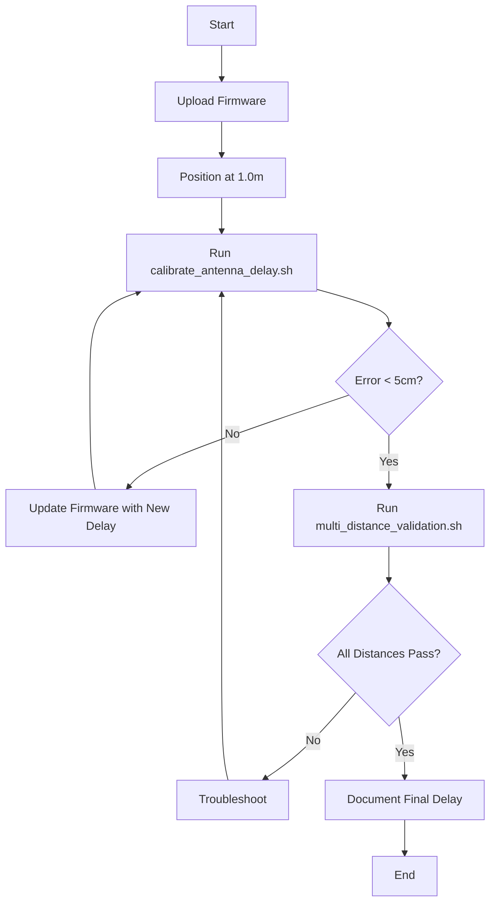

# DW1000 Antenna Delay Calibration Automation

This directory contains automated tools for calibrating DW1000 antenna delays to achieve ±10 cm ranging accuracy.

## Overview

Antenna delay calibration is critical for accurate UWB ranging. These tools automate the iterative calibration process described in [CALIBRATION_GUIDE.md](../../docs/findings/CALIBRATION_GUIDE.md).

**What these tools do:**
- Automate measurement collection
- Calculate calibration statistics
- Suggest antenna delay adjustments
- Validate calibration across multiple distances
- Generate reports and plots

**Goal:** Achieve <5 cm error through automated iterative calibration.

## Quick Start

### 1. Prepare Hardware

**Requirements:**
- 2x Arduino Uno + DW1000 modules (TAG + ANCHOR)
- USB cables for both devices
- Tape measure (accurate to ±1 cm)
- Clear test area (5+ meters)

### 2. Upload Firmware

```bash
# Navigate to calibration firmware
cd ../../tests/calibration/

# Edit calibration_test.ino
# - Set IS_TAG = true for TAG device
# - Set IS_TAG = false for ANCHOR device
# - Both should have same ANTENNA_DELAY (start with 16450)

# Upload to both devices using Arduino IDE or PlatformIO
```

### 3. Run Calibration

```bash
# Make scripts executable
chmod +x *.sh

# Run master calibration script
./calibrate_antenna_delay.sh /dev/ttyUSB0 1.0

# Arguments:
#   /dev/ttyUSB0 - Serial port of TAG device
#   1.0          - Actual distance in meters
```

### 4. Validate Calibration

```bash
# Run multi-distance validation
./multi_distance_validation.sh /dev/ttyUSB0

# Tests at: 0.5m, 1.0m, 2.0m, 3.0m, 5.0m
```

## Tools Description

### 1. calibrate_antenna_delay.sh

**Purpose:** Master calibration script with iterative refinement

**Features:**
- Automated measurement collection
- Real-time error calculation
- Antenna delay adjustment suggestions
- Convergence detection (<5 cm target)
- Progress tracking and logging

**Usage:**
```bash
./calibrate_antenna_delay.sh [PORT] [ACTUAL_DISTANCE]

# Examples:
./calibrate_antenna_delay.sh /dev/ttyUSB0 1.0
./calibrate_antenna_delay.sh /dev/ttyACM0 2.0
```

**Process:**
1. Collects 50-100 measurements at known distance
2. Calculates mean measured distance
3. Computes error vs actual distance
4. Suggests antenna delay adjustment
5. Prompts you to update firmware
6. Repeats until error < 5 cm (or max 10 iterations)

**Output:**
- Live statistics during calibration
- Final calibration report
- All measurement data saved to `calibration_data/`

**Example Output:**
```
================================================
   Iteration 1/10
   Current Antenna Delay: 16450
================================================

Collecting measurements for 30 seconds...
Collected 87 measurements

Results:
  Samples:          87
  Measured:         1.087 m
  Actual:           1.000 m
  Error:            +8.7 cm
  Std Dev:          1.2 cm

Adjustment needed:
  Current delay:    16450
  Adjustment:       +9
  New delay:        16459

ACTION REQUIRED: Update Antenna Delay
1. Update ANTENNA_DELAY in firmware to: 16459
2. Re-upload firmware to both TAG and ANCHOR
3. Press Enter when ready to continue...
```

### 2. multi_distance_validation.sh

**Purpose:** Validate calibration across multiple distances

**Features:**
- Tests at 5 standard distances (0.5m to 5.0m)
- Collects statistics at each distance
- Generates accuracy report
- Creates CSV output for analysis
- Pass/fail assessment

**Usage:**
```bash
./multi_distance_validation.sh [PORT]

# Example:
./multi_distance_validation.sh /dev/ttyUSB0
```

**Process:**
1. Prompts to position devices at each test distance
2. Collects 30+ measurements per distance
3. Calculates error and standard deviation
4. Generates summary report
5. Creates plots (if matplotlib available)

**Output:**
```
================================================
   Validation Summary
================================================
Distance     Measured     Error      Std Dev
--------     --------     -----      -------
0.5m         0.51m        +1cm       0.8cm
1.0m         1.01m        +1cm       1.2cm
2.0m         2.00m         0cm       1.5cm
3.0m         3.02m        +2cm       1.8cm
5.0m         5.04m        +4cm       2.5cm

Statistics:
  Average Error:  1.6 cm
  Maximum Error:  4.0 cm

================================================
   VALIDATION PASSED
================================================
```

**Files Generated:**
- `validation_summary.csv` - Tabular results
- `validation_report.txt` - Detailed analysis
- `validation_plot.png` - Graphs (if matplotlib available)

### 3. analyze_measurements.py

**Purpose:** Python tool for statistical analysis and plotting

**Features:**
- Parse CSV measurement data
- Calculate comprehensive statistics
- Generate plots (histogram, time series, error analysis)
- Export to JSON/CSV
- Antenna delay adjustment calculator

**Usage:**
```bash
# Basic analysis
python3 analyze_measurements.py \
    --input data.csv \
    --actual-distance 1.0

# Save results to JSON
python3 analyze_measurements.py \
    --input data.csv \
    --actual-distance 1.0 \
    --output-json results.json

# Generate plots
python3 analyze_measurements.py \
    --input data.csv \
    --actual-distance 1.0 \
    --plot \
    --output-plot results.png

# Quiet mode (for scripts)
python3 analyze_measurements.py \
    --input data.csv \
    --actual-distance 1.0 \
    --output-json results.json \
    --quiet

# Plot validation results
python3 analyze_measurements.py \
    --plot-validation validation_summary.csv \
    --output-plot validation.png
```

**Statistics Calculated:**
- Number of samples
- Mean distance
- Median distance
- Standard deviation
- Min/max distances
- Error (absolute and percentage)
- Antenna delay adjustment recommendation

**Plots Generated:**
1. Distance measurements over time
2. Histogram of distance distribution
3. Error over time
4. Statistics summary panel

### 4. calibration_test.ino

**Purpose:** Simplified firmware for calibration

**Features:**
- Clean CSV output format
- Configurable antenna delay via serial
- Minimal debug overhead
- High measurement rate
- Real-time configuration

**Configuration:**
```cpp
// In calibration_test.ino:
const bool IS_TAG = true;        // Set false for ANCHOR
uint16_t ANTENNA_DELAY = 16450;  // Starting value
```

**Serial Commands:**
```
D16459  - Set antenna delay to 16459
S       - Show current settings
R       - Reset statistics
```

**Output Format:**
```csv
# timestamp_ms,distance_m
1234,1.087123
1456,1.089456
1678,1.085234
...
```

**Example Session:**
```
# Open serial monitor (115200 baud)
# DW1000 Calibration Test
# Role: TAG
# Antenna Delay: 16450
# timestamp_ms,distance_m
1234,1.087
1456,1.089
1678,1.085

# Send command: S
# Current Settings:
#   Role: TAG
#   Antenna Delay: 16450
#   Total Ranges: 87
#   Failed Ranges: 0
#   Success Rate: 100.0%

# Send command: D16459
# Antenna delay set to: 16459
```

## Calibration Workflow

### Full Calibration Process



### Step-by-Step Guide

#### Step 1: Initial Setup

1. Upload `calibration_test.ino` to both devices
   - TAG: `IS_TAG = true`, `ANTENNA_DELAY = 16450`
   - ANCHOR: `IS_TAG = false`, `ANTENNA_DELAY = 16450`

2. Position devices at exactly 1.000 meters apart
   - Measure center-to-center
   - Ensure clear line-of-sight
   - Use stable mounting (tripods recommended)

#### Step 2: Run Calibration

```bash
./calibrate_antenna_delay.sh /dev/ttyUSB0 1.0
```

The script will:
1. Collect measurements automatically
2. Calculate error
3. Suggest new antenna delay
4. Prompt you to update firmware
5. Repeat until converged

**Typical calibration takes 2-4 iterations (5-10 minutes total)**

#### Step 3: Update Firmware

When prompted:
1. Note the new antenna delay value (e.g., 16459)
2. Edit `calibration_test.ino`:
   ```cpp
   uint16_t ANTENNA_DELAY = 16459;  // Updated value
   ```
3. Re-upload to BOTH TAG and ANCHOR
4. Press Enter to continue

#### Step 4: Validation

After calibration converges:
```bash
./multi_distance_validation.sh /dev/ttyUSB0
```

For each distance:
1. Position devices at prompted distance
2. Press Enter to start measurement
3. Wait for data collection (30 seconds)
4. Review results

#### Step 5: Documentation

Record final results:
- Final antenna delay value: `16459`
- Calibration date: `2026-01-11`
- Test environment: `Indoor, 22°C`
- Module serial numbers: `TAG-001`, `ANCHOR-001`

Store in your project configuration.

## Output Directory Structure

```
calibration_data/
├── calibration_20260111_143022.log          # Calibration log
├── current_delay.txt                         # Current antenna delay
├── iter_1_delay_16450.csv                   # Iteration 1 measurements
├── iter_1_delay_16450.json                  # Iteration 1 statistics
├── iter_2_delay_16459.csv                   # Iteration 2 measurements
├── iter_2_delay_16459.json                  # Iteration 2 statistics
└── calibration_report_20260111_143022.txt   # Final report

validation_data/
├── validation_20260111_150000/
│   ├── distance_0.5m.csv                    # Measurements at 0.5m
│   ├── distance_0.5m.json                   # Statistics at 0.5m
│   ├── distance_1.0m.csv                    # Measurements at 1.0m
│   ├── distance_1.0m.json                   # Statistics at 1.0m
│   ├── distance_2.0m.csv
│   ├── distance_2.0m.json
│   ├── distance_3.0m.csv
│   ├── distance_3.0m.json
│   ├── distance_5.0m.csv
│   ├── distance_5.0m.json
│   ├── validation_summary.csv               # Summary table
│   ├── validation_report.txt                # Detailed report
│   ├── validation_plot.png                  # Plots (if available)
│   └── validation.log                       # Process log
```

## Troubleshooting

### Problem: No measurements collected

**Symptoms:**
```
Collected 0 measurements
WARNING: Only 0 measurements collected
```

**Solutions:**
1. Check serial port connection
   ```bash
   ls -la /dev/ttyUSB* /dev/ttyACM*
   ```

2. Verify firmware is running
   - Open serial monitor manually
   - Should see CSV output: `timestamp,distance`

3. Check USB permissions
   ```bash
   sudo usermod -a -G dialout $USER
   # Logout and login again
   ```

4. Verify both devices are powered and running

### Problem: Calibration won't converge

**Symptoms:**
```
Reached maximum iterations (10)
Current error: 12.3 cm
```

**Solutions:**

1. **Verify measurement accuracy**
   - Double-check tape measure distance
   - Measure center-to-center (antenna to antenna)
   - Ensure devices are stable (not moving)

2. **Check for RF interference**
   - Move away from WiFi routers
   - Avoid metal surfaces
   - Test in different location

3. **Verify both devices have same delay**
   - Both TAG and ANCHOR must use same `ANTENNA_DELAY`
   - Re-upload firmware to both if uncertain

4. **Try different distance**
   - If 1.0m doesn't work, try 2.0m
   - Some distances have better multipath characteristics

### Problem: High standard deviation

**Symptoms:**
```
Std Dev: 15.2 cm
```

**Solutions:**

1. **Improve line-of-sight**
   - Remove obstacles between devices
   - Elevate devices above ground
   - Test outdoors if possible

2. **Reduce interference**
   - Change DW1000 channel (edit firmware)
   - Turn off nearby 2.4 GHz devices
   - Use battery power (eliminate USB noise)

3. **Check hardware**
   - Verify antenna connections
   - Check for loose connectors
   - Test with different modules

### Problem: Distance-proportional error

**Symptoms:**
```
Distance    Error
0.5m        +1 cm
1.0m        +2 cm
2.0m        +4 cm
5.0m        +10 cm
```

**Solutions:**

1. **This indicates clock drift** (rare with DS-TWR)
   - Check crystal oscillator (should be 38.4 MHz)
   - May be hardware defect
   - Try different modules

2. **Or incorrect distance measurements**
   - Verify all distances measured accurately
   - Use same reference point for all measurements

### Problem: Antenna delay outside normal range

**Symptoms:**
```
WARNING: New delay 17200 is outside normal range (16300-16600)
```

**Solutions:**

1. **Check measurement setup**
   - Verify actual distance is correct
   - Ensure measuring center-to-center
   - Not board edge to board edge

2. **Hardware issue**
   - Unusual antenna delay may indicate hardware problem
   - Check antenna connection
   - Try different module

3. **Different module type**
   - Some DW1000 variants have different ranges
   - Check module datasheet

### Problem: Python errors

**Symptoms:**
```
ERROR: Python 3 is required but not found
```

**Solutions:**

1. **Install Python 3**
   ```bash
   # Ubuntu/Debian
   sudo apt-get install python3

   # Check version
   python3 --version
   ```

2. **Install matplotlib (optional, for plots)**
   ```bash
   pip3 install matplotlib numpy
   ```

## Advanced Usage

### Manual Analysis

You can use the Python script independently:

```bash
# Collect data manually (e.g., using Arduino Serial Monitor)
# Save to file: measurements.csv

# Analyze
python3 analyze_measurements.py \
    --input measurements.csv \
    --actual-distance 1.0 \
    --output-json results.json \
    --plot \
    --output-plot plot.png
```

### Batch Calibration

Calibrate multiple device pairs:

```bash
#!/bin/bash
# calibrate_all.sh

DEVICES=(
    "TAG-001 ANCHOR-001"
    "TAG-002 ANCHOR-002"
    "TAG-003 ANCHOR-003"
)

for pair in "${DEVICES[@]}"; do
    echo "Calibrating $pair"
    read -p "Upload firmware and press Enter..."

    ./calibrate_antenna_delay.sh /dev/ttyUSB0 1.0

    read -p "Note delay and press Enter..."
done
```

### Custom Test Distances

Edit `multi_distance_validation.sh`:

```bash
# Change test distances
declare -a TEST_DISTANCES=(1.0 3.0 5.0 7.0 10.0)
```

### Integration with PlatformIO

Create script to upload firmware automatically:

```bash
#!/bin/bash
# upload_calibration_firmware.sh

DELAY=$1
PORT=$2

# Update antenna delay in firmware
sed -i "s/ANTENNA_DELAY = [0-9]*/ANTENNA_DELAY = ${DELAY}/" \
    ../../tests/calibration/calibration_test.ino

# Upload using PlatformIO
cd ../../tests/calibration/
pio run -t upload --upload-port ${PORT}
```

## Best Practices

### Measurement Environment

1. **Indoor calibration:**
   - Use hallway or large room
   - Minimize reflections (avoid metal walls)
   - Stable temperature (±2°C)

2. **Outdoor calibration:**
   - Better for accuracy (no multipath)
   - Avoid rain/extreme temperatures
   - Use windless day (stable positioning)

3. **Device positioning:**
   - Use tripods or stable mounts
   - Same height for both devices
   - Antennas parallel (both vertical or both horizontal)

### Accuracy Tips

1. **Distance measurement:**
   - Measure antenna-to-antenna (not board edge)
   - Use metal tape measure (no sag)
   - Verify with second measurement

2. **Data collection:**
   - Collect 50+ samples per iteration
   - Ignore first 5-10 measurements (settling)
   - Ensure devices are stationary

3. **Firmware updates:**
   - Always update BOTH devices with same delay
   - Verify upload succeeded
   - Reset devices after upload

### Documentation

Record for each calibration:
```
Calibration Record: TAG-001 + ANCHOR-001
Date: 2026-01-11
Temperature: 22°C
Location: Indoor lab
Final Antenna Delay: 16459
Validation Results:
  - 0.5m: +1.0 cm ±0.8 cm
  - 1.0m: +1.0 cm ±1.2 cm
  - 2.0m: +0.0 cm ±1.5 cm
  - 3.0m: +2.0 cm ±1.8 cm
  - 5.0m: +4.0 cm ±2.5 cm
Status: PASSED
```

## References

- [CALIBRATION_GUIDE.md](../../docs/findings/CALIBRATION_GUIDE.md) - Detailed calibration theory
- [DW1000 Datasheet](https://www.decawave.com/dw1000/datasheet/) - Section 7.2.40 (Antenna Delay)
- [DW1000 User Manual](https://www.decawave.com/dw1000/usermanual/) - Chapter 12 (Calibration)

## Support

For issues or questions:
1. Check [Troubleshooting](#troubleshooting) section
2. Review [CALIBRATION_GUIDE.md](../../docs/findings/CALIBRATION_GUIDE.md)
3. Examine log files in `calibration_data/` and `validation_data/`

## License

MIT License - See project root for details

---

**Last Updated:** 2026-01-11
**Version:** 1.0
**Author:** SwarmLoc Project
